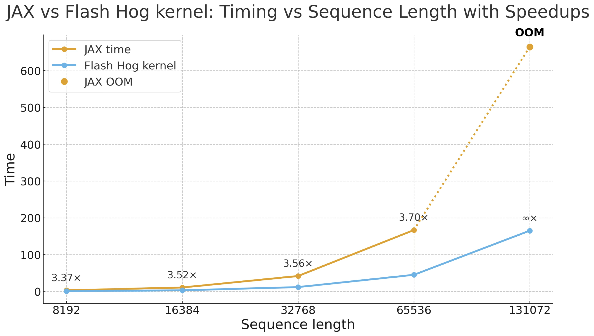
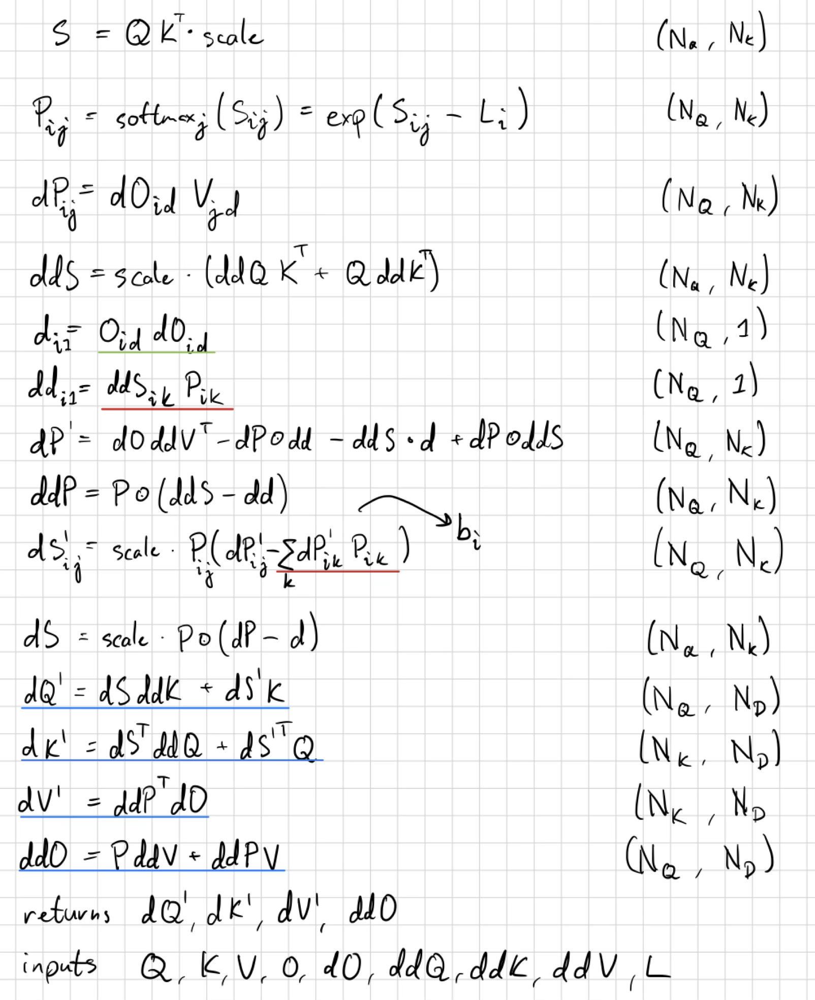

# Flash Hog

This repo contains the code for Flash Higher-Order-Gradients, aka. Flash Hog.
This kernel achieves around a 3.7x speedup over an XLA optimized kernel, with linear memory scaling instead of quadratic scaling.

## Installation
TODO

## Method
Flash Hog does 4 recomputation passes to avoid any atomics or saving any intermediary tensors of shape `(N_Q, N_K)`.
This shakes out to be thread-wise tiling across Q in 3 passes first, once to compute `dd`, then once for `b`, then once for both `dQ'` and `ddO`.
Finally we do another pass tiled over K, producing `dK'` and `dV'`.
The equations we implement are the following:

